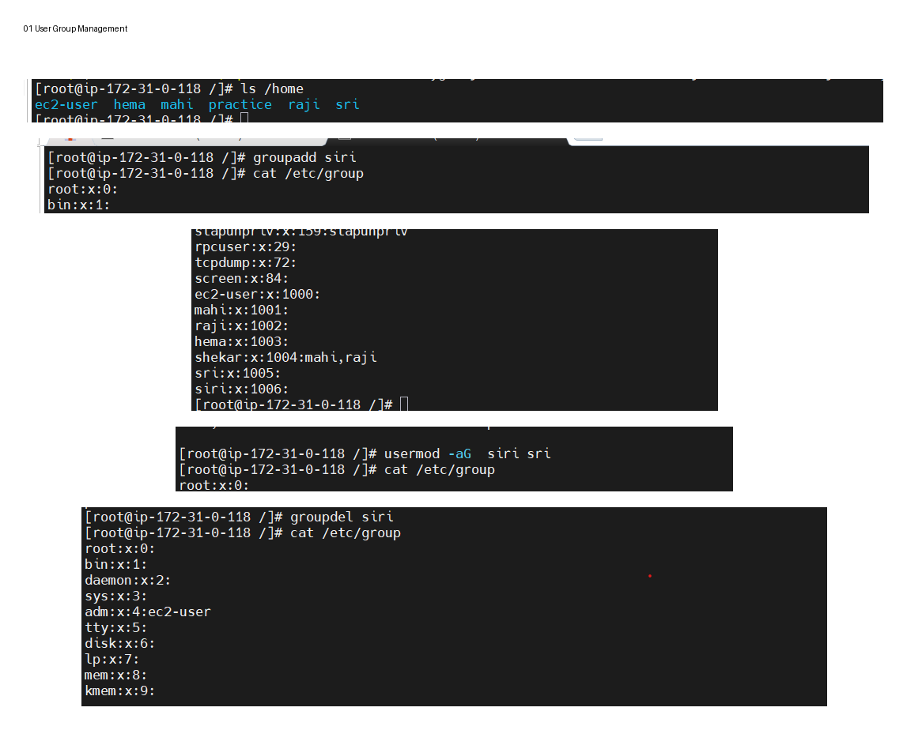
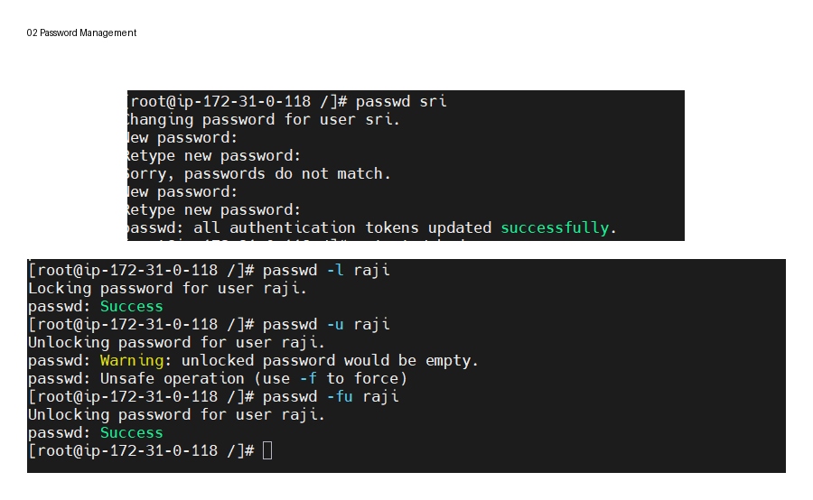
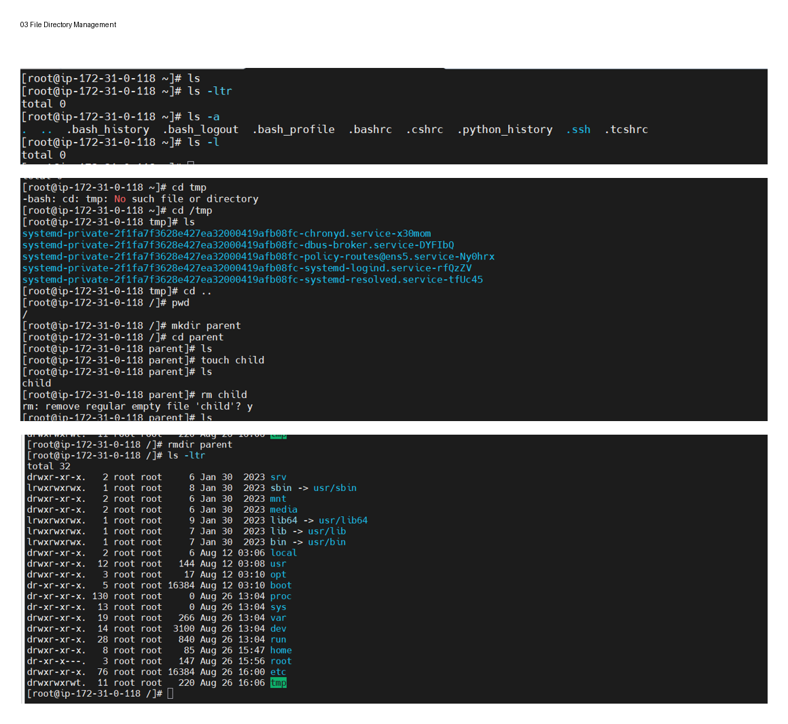
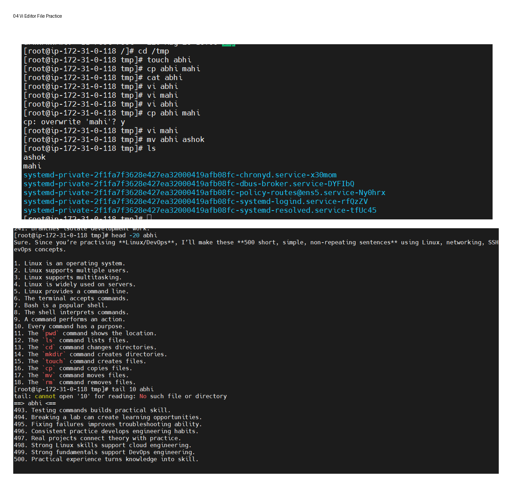
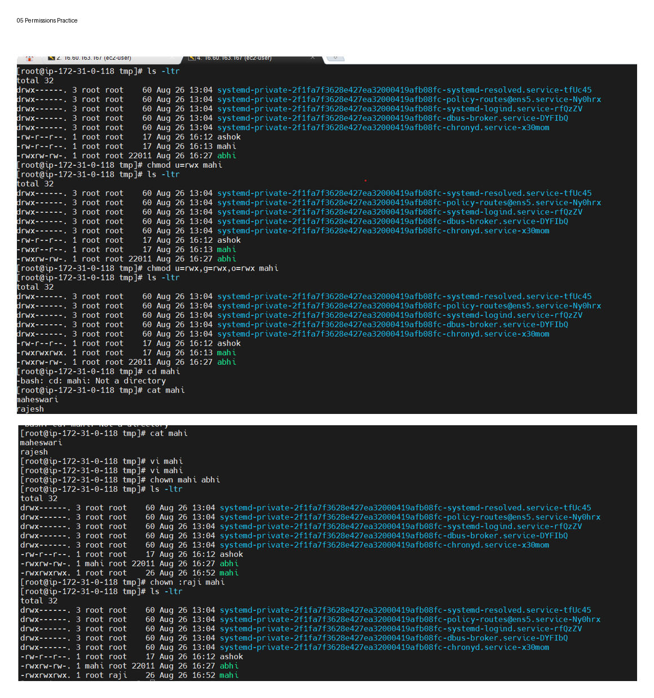
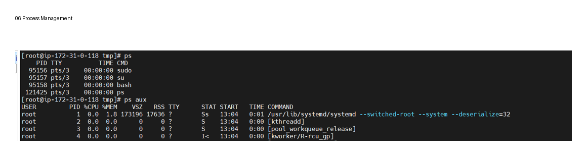

# Linux Fundamentals 

A collection of my Linux notes, commands and selected hands-on practical exercises while building my foundation for Cloud & DevOps.

## About This Repository

This repository documents my learning journey through Linux fundamentals and basic Linux administration.

My focus was on understanding the concepts, practising commands, and applying them in a Linux environment.

The practical section contains selected examples of the exercises I completed.

## Topics Covered

- Linux Fundamentals
- File & Directory Management
- Linux Filesystem
- User Management
- Group Management
- Password Management
- File Permissions
- Process Management
- Disk Management
- vi Editor
- Linux Networking

## Selected Hands-on Practice

### User & Group Management

Practised creating users and groups, modifying group membership, and managing user accounts.

### Password Management

Practised changing, locking and unlocking user passwords.

### File & Directory Management

Practised navigating the Linux filesystem and working with files and directories.

### vi Editor & File Practice

Practised using the vi editor and basic file operations.

### Permissions Practice

Practised Linux file and directory permissions.

### Process Management

Practised viewing and working with Linux processes.

## Practical Documentation

The complete practical documentation is available here:

## Learning Approach

I focused on understanding Linux concepts and practising commands rather than only watching tutorials.

This repository represents my learning progress and selected practical work.

## Next Steps

Continue strengthening my Linux and networking foundation and progress towards:

- Shell Scripting
- Git & GitHub
- AWS
- Infrastructure as Code
- Containers
- CI/CD
